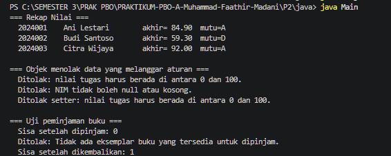
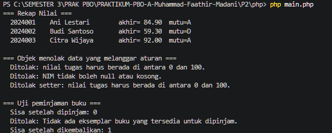

# LAPORAN PRAKTIKUM PEMROGRAMAN BERBASIS OBJEK

| Informasi Praktikan | Keterangan |
| :--- | :--- |
| **Nama** | Muhammad Faathir Madani |
| **NPM** | 4525210100 |
| **Kelas** | A |
| **Mata Kuliah** | Pemrograman Berbasis Objek (PBO) |
| **Pertemuan** | Pertemuan 2 - Kelas, Objek, dan Enkapsulasi |
| **Tanggal** | 10 September 2026 |

---

## 1. Implementasi Java

### 1.1. File: `Mahasiswa.java`
**Penjelasan Kode:**
> Mengimplementasikan kelas `Mahasiswa` berenkapsulasi dengan atribut `nim`, `nama`, `nilaiTugas`, `nilaiUts`, dan `nilaiUas` berakses `private`. Menggunakan kata kunci `final` pada `nim` agar tidak dapat diubah setelah objek dibuat, serta menerapkan validasi *invariant* pada *constructor* dan *setter* (rentang nilai 0–100 dan NIM tidak boleh kosong) untuk menghitung nilai akhir serta menentukan huruf mutu secara konsisten.

**Bukti Eksekusi (Screenshot):**
* **Before** *(Kondisi awal / Kesalahan kompilasi)*:

* **After** *(Kondisi akhir / Eksekusi berhasil)*:

### 1.2. File: `Buku.java`
**Penjelasan Kode:**
> Mengimplementasikan kelas `Buku` dengan atribut privat `isbn`, `judul`, `penulis`, `jumlahEksemplar`, dan `jumlahTersedia`. Menggunakan `final` pada atribut identitas `isbn`, menjaga *invariant* jumlah eksemplar tidak boleh negatif, serta menyediakan metode peristiwa bisnis `pinjam()` dan `kembalikan()` untuk mengelola ketersediaan stok buku secara aman tanpa memberikan *setter* bebas dari luar kelas.

**Bukti Eksekusi (Screenshot):**
* **Before** *(Kondisi awal / Kesalahan kompilasi)*:

* **After** *(Kondisi akhir / Eksekusi berhasil)*:

### 1.3. File: `Main.java`
**Penjelasan Kode:**
> Berfungsi sebagai kelas penguji utama (*driver code*) untuk membuktikan bahwa enkapsulasi pada kelas `Mahasiswa` dan `Buku` bekerja dengan benar. Kelas ini melakukan instansiasi objek valid, menampilkan rekap nilai dan pengujian peminjaman buku, serta menangkap *exception* (`try-catch`) ketika terjadi percobaan pembuatan objek yang melanggar aturan *invariant*.

**Bukti Eksekusi (Screenshot):**
* **Before** *(Kondisi awal / Kesalahan kompilasi)*:

* **After** *(Kondisi akhir / Eksekusi berhasil)*:

### Output
**Output Program:**

---

## 2. Implementasi PHP

### 2.1. File: `Mahasiswa.php`
**Penjelasan Kode:**
> Merupakan konversi kelas `Mahasiswa` ke dalam PHP 8 dengan mengaktifkan `declare(strict_types=1)` untuk menjamin tipe data ketat. Menerapkan fitur *constructor property promotion* dan modifikator `readonly` pada atribut `$nim`, serta melakukan validasi batas nilai pada *constructor* dan metode *setter* agar perilaku dan keluarannya identik dengan versi Java.

**Bukti Eksekusi (Screenshot):**
* **Before** *(Kondisi awal / Galat logika)*:

* **After** *(Kondisi akhir / Eksekusi berhasil)*:

### 2.2. File: `Buku.php`
**Penjelasan Kode:**
> Mengimplementasikan kelas `Buku` dalam bahasa PHP dengan properti privat dan `readonly` pada `$isbn`. Menjaga konsistensi stok eksemplar melalui fungsi bisnis `$this->pinjam()` dan `$this->kembalikan()`, yang akan melemparkan *exception* saat aturan *invariant* (seperti meminjam saat stok habis) dilanggar oleh pemanggil.

**Bukti Eksekusi (Screenshot):**
* **Before** *(Kondisi awal / Galat logika)*:

* **After** *(Kondisi akhir / Eksekusi berhasil)*:

### 2.3. File: `main.php`
**Penjelasan Kode:**
> Merupakan skrip pengujian utama versi PHP yang menguji seluruh alur program `Mahasiswa` dan `Buku`. Menguji pembuatan objek berdata valid, memproses transaksi peminjaman buku, serta memverifikasi mekanisme penolakan data tidak sah sehingga menghasilkan *output* yang 100% identik dengan versi Java.

**Bukti Eksekusi (Screenshot):**
* **Before** *(Kondisi awal / Galat logika)*:

* **After** *(Kondisi akhir / Eksekusi berhasil)*:

### Output
**Output Program:**

---

## 3. Kesimpulan
> Enkapsulasi bukan sekadar menyembunyikan data dengan modifikator `private`, melainkan mekanisme untuk menjamin *invariant* (aturan bisnis yang harus selalu benar) di dalam objek itu sendiri. Dengan memvalidasi data langsung pada *constructor* serta mengganti *setter* teknis menggunakan metode berpenamaan peristiwa bisnis (seperti `pinjam()`), objek bertanggung jawab penuh atas keabsahan datanya baik pada Java maupun PHP.