# Laporan Praktikum PBO - Pertemuan 3

**Nama:** Muhammad Faathir Madani
**NPM:** 4525210100
**Kelas:** Praktikum PBO A

---

## 1. Implementasi Java
Berikut adalah dokumentasi kode tiap *class* dan hasil eksekusi program menggunakan Java.

### A. Screenshot Kode Java
**1. Main.java**
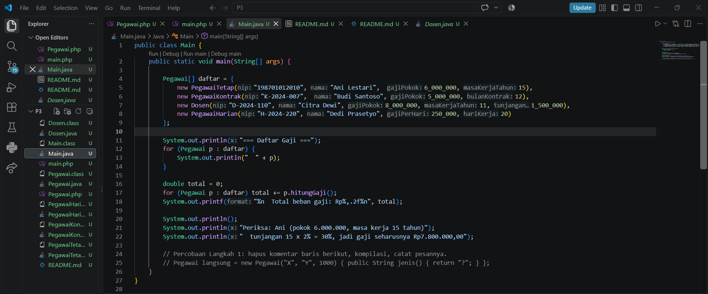

**2. Pegawai.java (Abstract Class)**
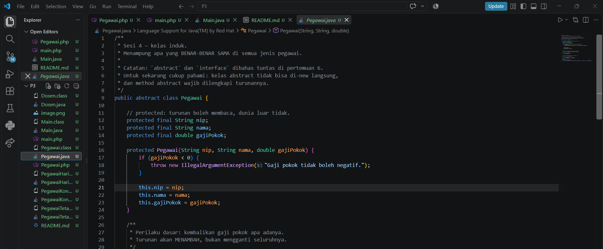
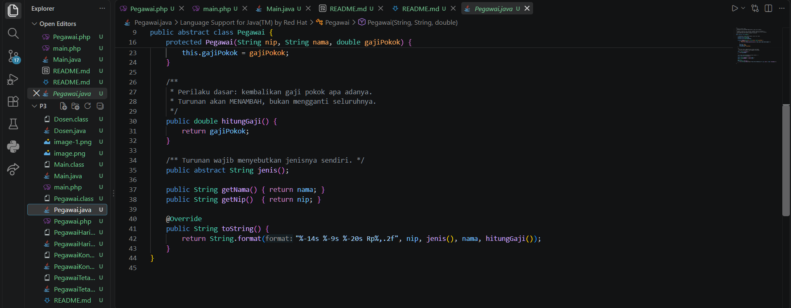

**3. PegawaiTetap.java**
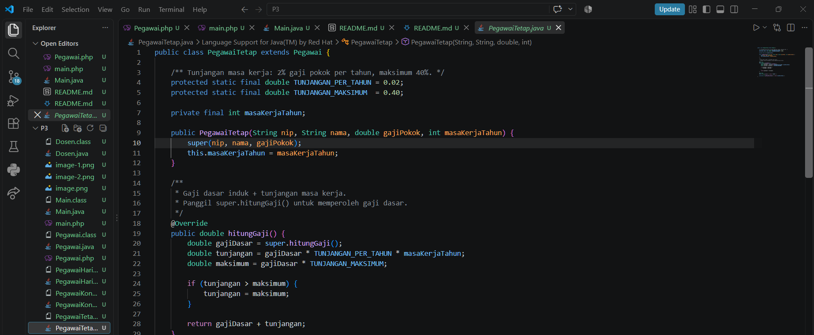
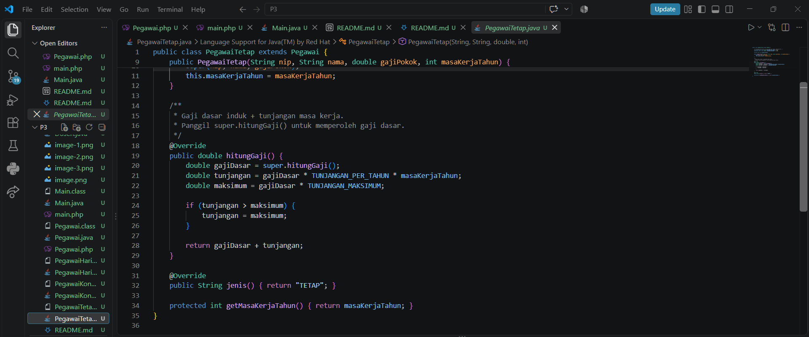

**4. PegawaiKontrak.java**
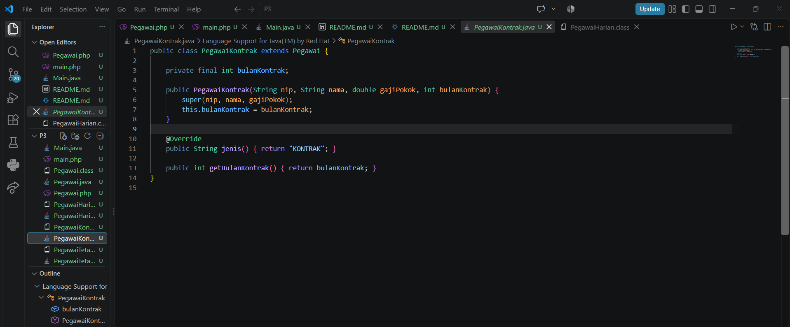

**5. PegawaiHarian.java**
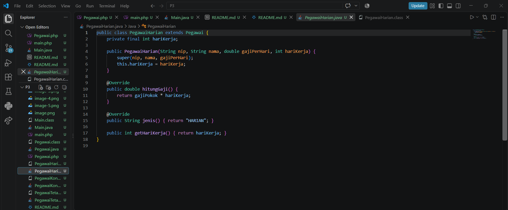

**6. Dosen.java**
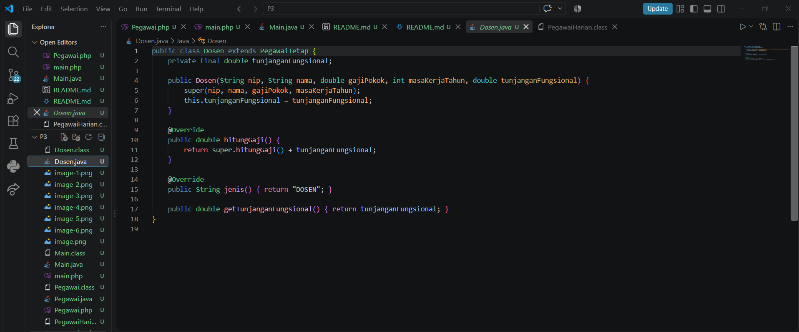

### B. Hasil Running Program Java
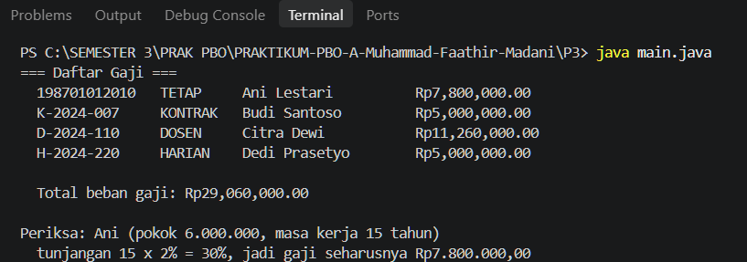
---

## 2. Implementasi PHP
Berikut adalah dokumentasi kode dan hasil eksekusi program menggunakan PHP.

### A. Screenshot Kode PHP
**1. main.php**
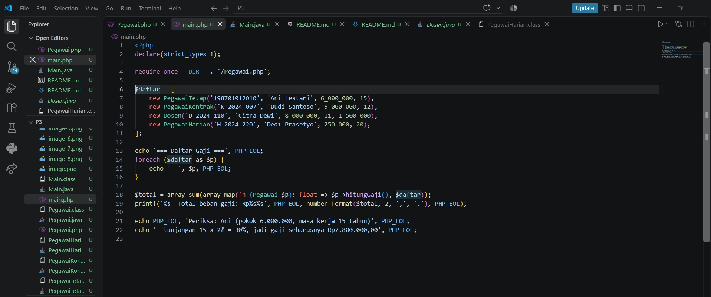

**2. Pegawai.php**
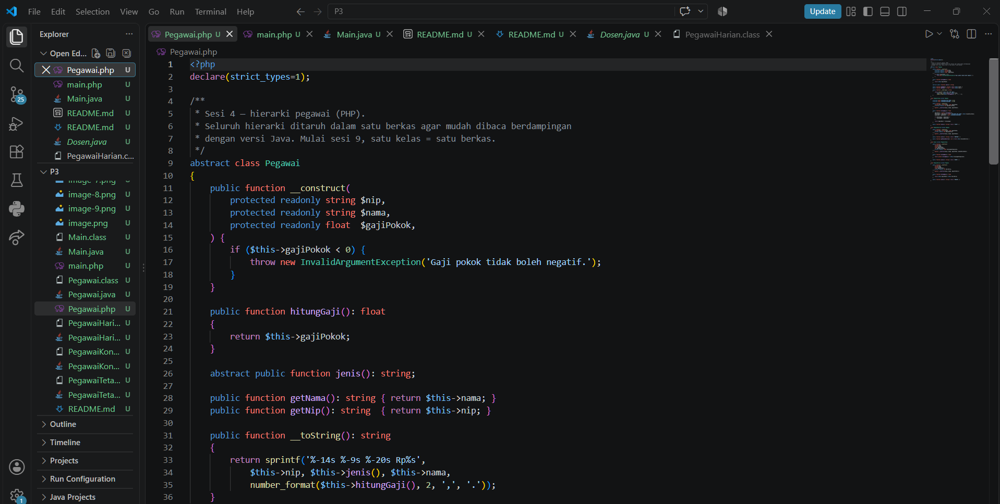
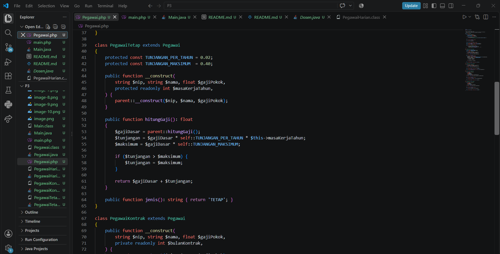
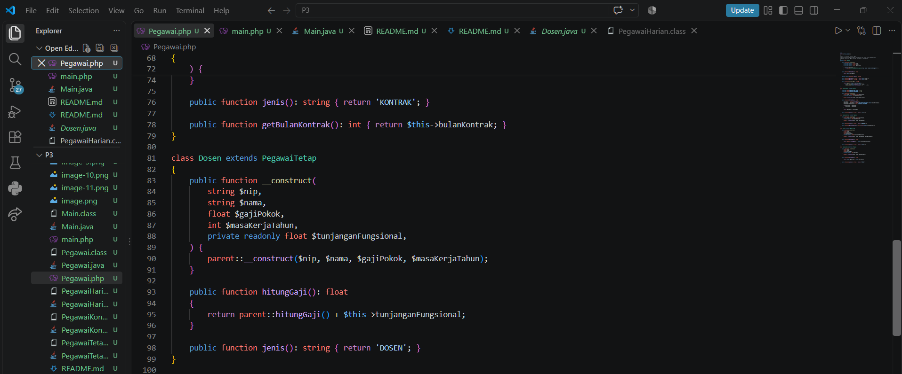
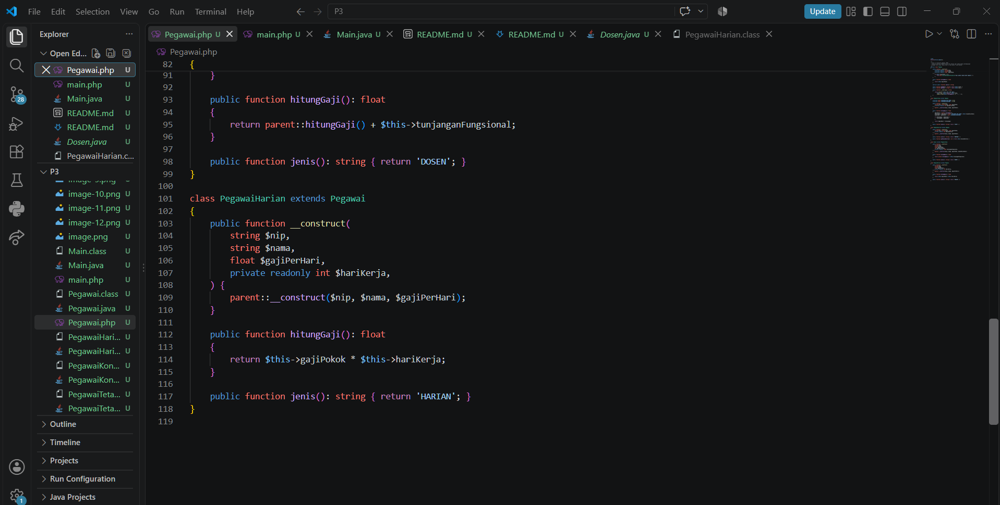

### B. Hasil Running Program PHP
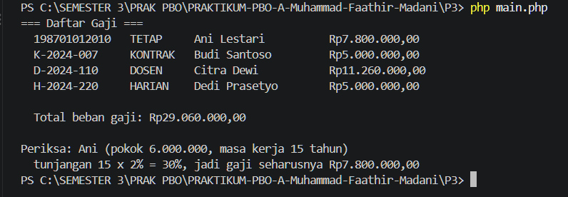