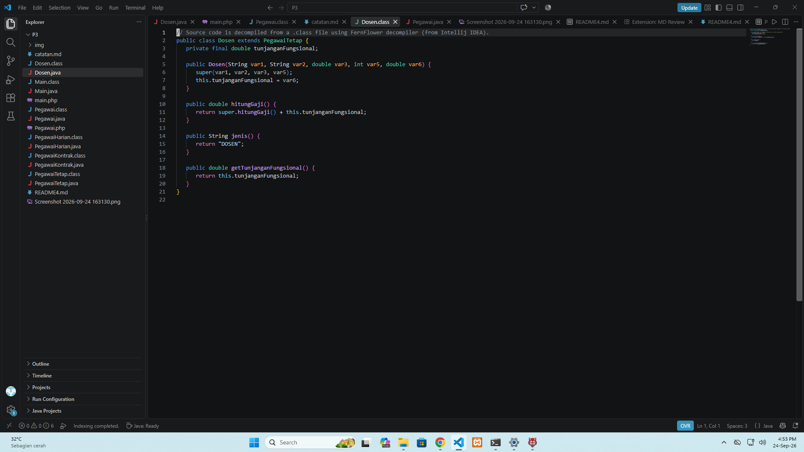
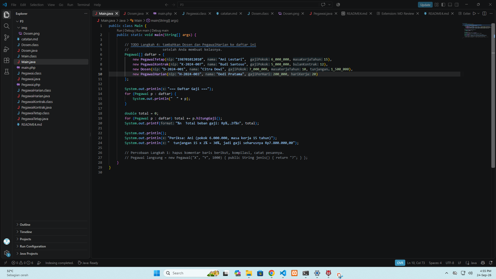

# Laporan Praktikum PBO

## Identitas
- Nama: Muhammad Faathir Madani
- NPM: 4525210100
- Dosen Pengampu: Adi Wahyu Pribadi, S.Si., M.Kom
- Mata Kuliah: Pemrograman Berorientasi Objek

---

## Tugas yang Sudah Dikerjakan
- Membuat kelas induk `Pegawai` sebagai kelas abstrak
- Menambahkan validasi agar gaji pokok tidak boleh negatif
- Mengimplementasikan method `hitungGaji()` pada kelas induk
- Membuat class `PegawaiTetap` dengan tunjangan masa kerja
- Membuat class `PegawaiKontrak` tanpa tunjangan masa kerja
- Membuat class `Dosen` dengan tambahan tunjangan fungsional
- Membuat class `PegawaiHarian` dengan gaji per hari kerja
- Menambahkan data pegawai ke array `Main`
- Menghitung total gaji keseluruhan

---

## ScreenShoot Dosen.java

---
## ScreenShoot Main.java

---

## ScreenShoot Pegawai.java

---

## ScreenShotPegawaiHarian.java

---

## Screenshoot

---

## Catatan                
Tugas ini sudah dikerjakan sesuai instruksi TODO, yaitu:
- validasi gaji pokok
- perhitungan tunjangan pegawai tetap
- pengecekan pegawai kontrak tidak mendapat tunjangan masa kerja
- pembuatan kelas `Dosen` dan `PegawaiHarian`
- menampilkan daftar gaji dan total gaji