# Laporan Praktikum PBO Pertemuan05
**Nama          :** Muhammad Faathir Madani
**NPM           :** 4525210100
**Mata Kuliah   :** Pemrograman Berorientasi Objek
## Materi
Menghitung bangun datar
Materi: Polimorfisme
## Screenshot Coding AntiPattern.java
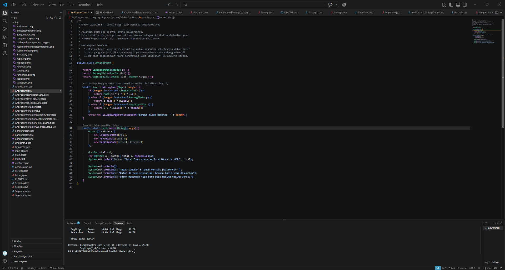

## Screenshot Coding AntiPatternRefaktor.java
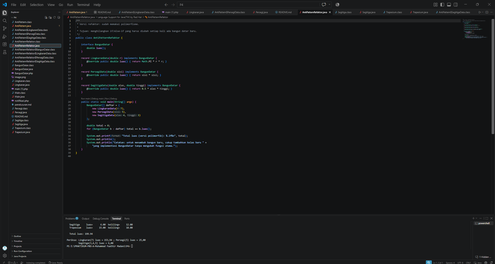

## Screenshot Coding BangunDatar.java
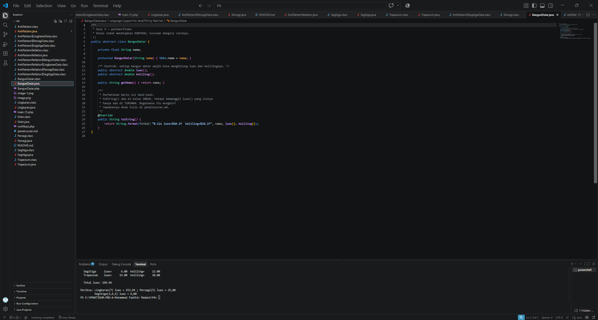

## Screenshot Coding Lingkaran.java
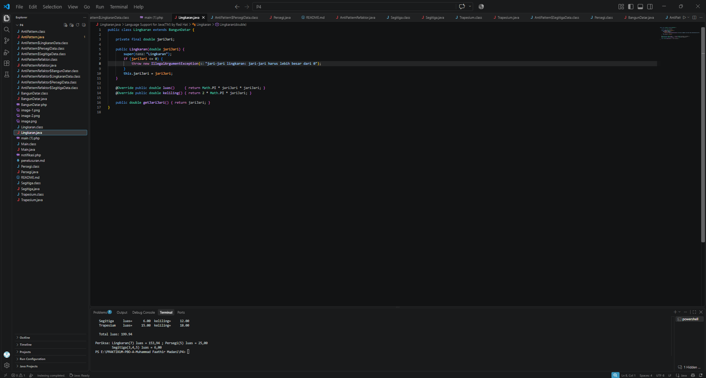

## Screenshot Coding Main.java
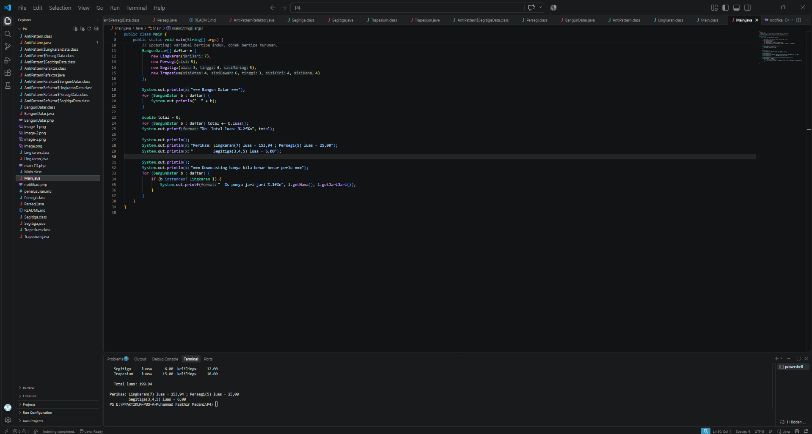

## Screenshot Coding Persegi.java
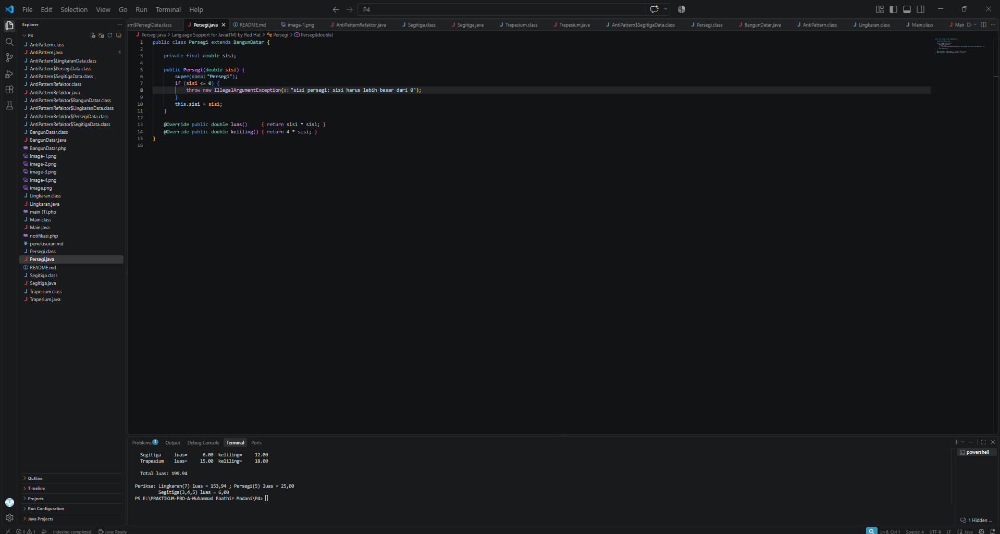

## Screenshot Coding Segitiga.java
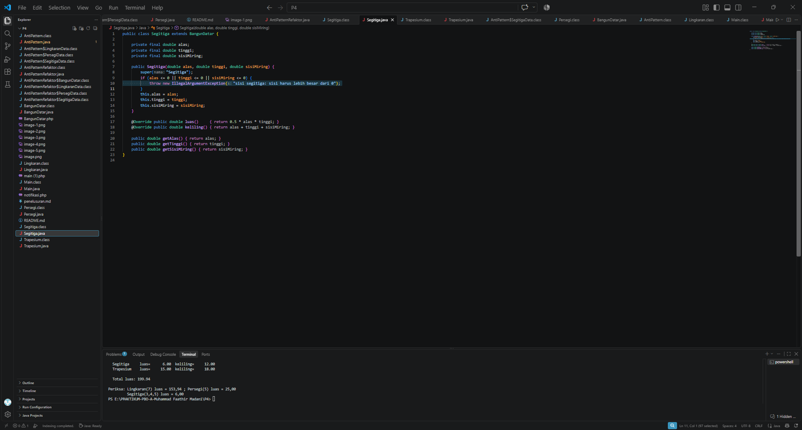

## Screenshot Coding Trapesium.java
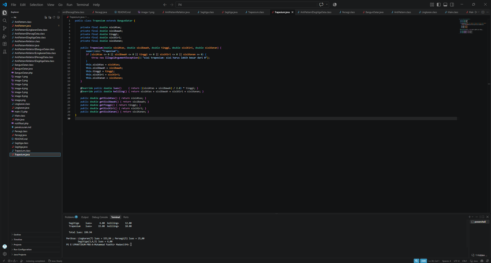

## Hasil Running Program java
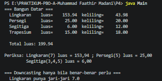

## Hasil Running Program AntiPattern.java
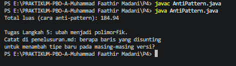

## Hasil Running Program AntiPatternRefaktor.java
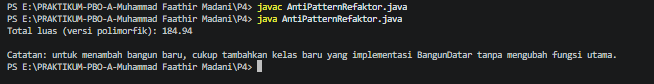

## Screenshot Coding Main.php
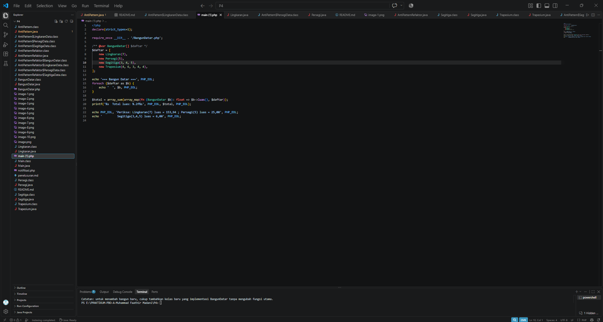

## Screenshot Coding BangunDatar.php
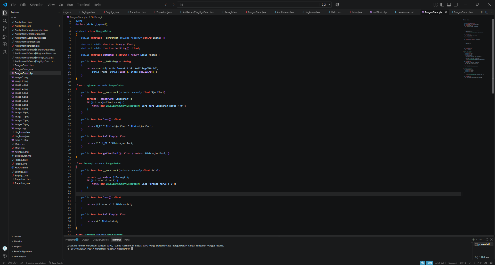
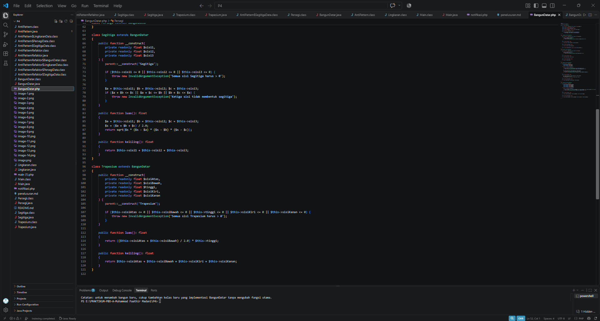

## Screenshot Coding notifikasi.php
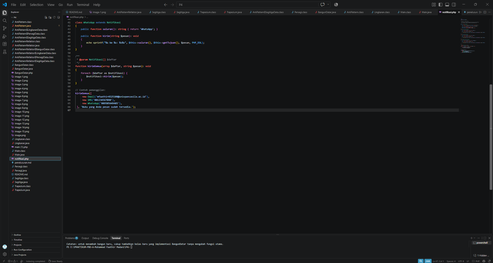

## Hasil Running Program PHP
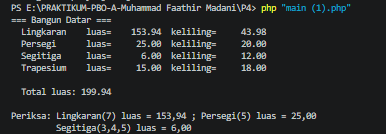