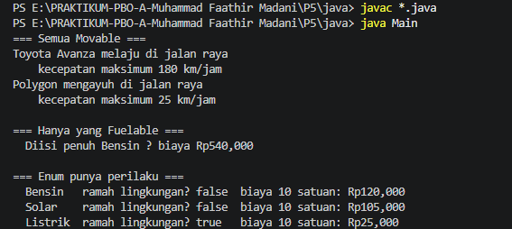
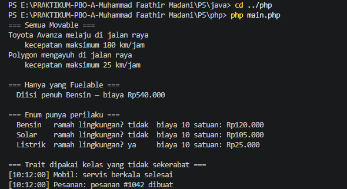

# Dokumentasi Tugas P5 - Abstract, Interface & Enum

**Data Mahasiswa:**
- **Nama:** Muhammad Faathir Madani
- **NPM:** 4525210100
- **Mata Kuliah:** Pemrograman Berbasis Objek

---

### Penjelasan Konsep P5:
Pada program ini, diimplementasikan beberapa konsep lanjutan dari PBO yang telah dikonversi secara presisi dari Java ke PHP:

1. Abstract Class (Kendaraan): Berfungsi sebagai kerangka dasar kendaraan yang memiliki abstract method. Method ini wajib diisi logikanya oleh kelas turunan.
2. Interface (Movable & Fuelable): Berfungsi sebagai kontrak perilaku. Kelas Mobil mengimplementasikan Fuelable karena menggunakan bahan bakar, sedangkan kelas Sepeda tidak.
3. Enum (TipeBahanBakar): Mengamankan tipe data jenis bahan bakar menjadi opsi statis yang pasti agar tidak terjadi kesalahan input.
4. Polymorphism: Pemanggilan method dinamis saat runtime, di mana satu referensi dapat mengeksekusi perilaku yang berbeda tergantung pada objek aslinya.

---

### Hasil Running Program Java

### Hasil Running Program PHP
